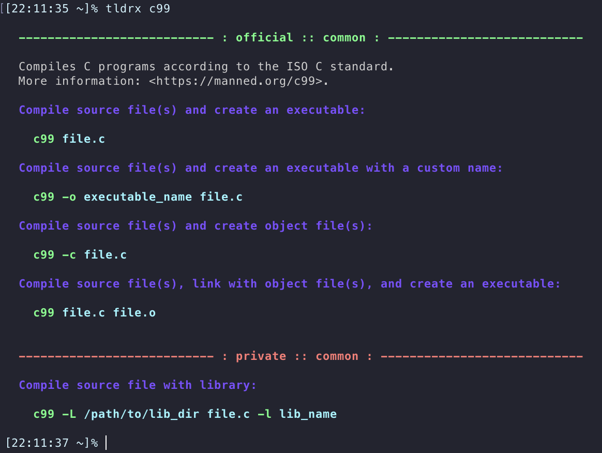

<h1>TLDRx</h1>

  
  
  

English | <a href="README.zh.md">简体中文</a>

  

## Features

- [x] Support private tldr pages repo. 
- [x] Support editing private tldr pages.
- [x] Show pages with platform info attached.
- [x] Adheres to [tldr-pages client specification](https://github.com/tldr-pages/tldr/blob/main/CLIENT-SPECIFICATION.md).[^1]
- [x] Offline caching official tldr pages repo.
- [x] Configurable official tldr pages archive download link.
- [x] Honor `HTTP_PROXY` and `HTTPS_PROXY` system proxies (handy for regulation area).
- [x] Advanced configuration: color style, platform, editor...
- [x] Support [new tldr pages syntax](https://github.com/tldr-pages/tldr/pull/958).[^2]

## Usages

Show pages for `git commit`:

    tldrx git commit

Update local cache(Required for the first time before showing official pages):

    tldrx --update

Edit or create private page for `git commit`:

    tldrx -e git commit

For more:

    tldrx --help

## Installation

Assume you have rust cargo installed:

    cargo install tldrx

## Benchmarks

Benchmarked in a Docker container([Dockerfile](benches/Dockerfile)) on a GitHub Acions machine([2C-7GB-SSD]) 
using `hyperfine` with 100 round against each client. 

| Client [2022-10-05]                                          | Build Flags      |  Mean [ms] | Min [ms] | Max [ms] |    Relative |
| :----------------------------------------------------------- | :--------------- | ---------: | -------: | -------: | ----------: |
| [outfieldr](https://gitlab.com/ve-nt/outfieldr)              | `-Drelease-safe` | 23.0 ± 2.6 |     18.5 |     36.6 |        1.00 |
| [tldrx](https://github.com/tldrx/tldrx)                      | `--release`      | 30.2 ± 3.0 |     25.5 |     43.0 | 1.32 ± 0.20 |
| [tealdeer](https://github.com/dbrgn/tealdeer)                | `--release`      | 32.9 ± 3.5 |     27.3 |     45.4 | 1.43 ± 0.22 |
| [tldr c client](https://github.com/tldr-pages/tldr-c-client) | `-O3`            | 76.8 ± 5.8 |     63.8 |    106.4 | 3.34 ± 0.45 |

P.S. Studies shows that response within `100ms` time frame human brain would treat it as an instantaneous reaction[^3][^4].
Recommendation here is chose a client base on the provided features that suits you while the response time is within `100ms`.
If you want more performance, build `tldrx` as a static binary that would reduce the dynamic library load time.

## License

This project is dual-licensed under [MIT](LICENSE-MIT) license and [MulanPSL-2.0](LICENSE-MulanPSL) license.
You can freely choose one or the other that suits you.

[^1]: 1. Use `tldrx` instead of `tldr`.
      2. `-l` `--list` options for listing all the pages not supported yet.

[^2]: The new syntax for tldr-pages is an experimental RFC.

[^3]: https://www.nngroup.com/articles/response-times-3-important-limits
[^4]: https://en.wikipedia.org/wiki/Time_perception

[2C-7GB-SSD]: https://docs.github.com/en/actions/using-github-hosted-runners/about-github-hosted-runners#supported-runners-and-hardware-resources
[2022-10-05]: https://github.com/tldrx/tldrx/actions/runs/3188985781/jobs/5202273436