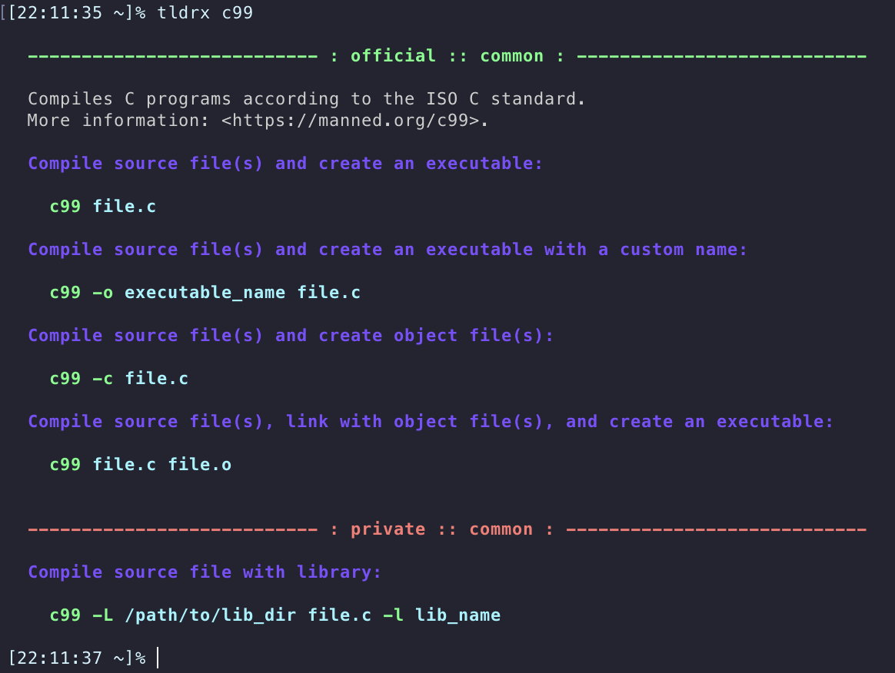

<h1>TLDRx</h1>

<p>
  <a href="https://github.com/tldrx/tldrx/actions/workflows/ci.yml"></a>
  <a href="https://github.com/tldrx/tldrx/blob/main/README.zh.md#%E8%AE%B8%E5%8F%AF%E8%AF%81"></a>
  <a href="https://crates.io/crates/tldrx"></a>
</p>

<p><a href="README.md">English</a> | 简体中文</p>

<p>
  
</p>


## 说明

> #### tldr-pages:
> Simplified and community-driven man pages.

> #### tldr:
> TL;DR stands for "Too Long; Didn't Read".

`tldr-pages` 此处称之为「简读页」。简读页可以看作是简化版的命令手册页（man pages）。
通常一些命令或工具为了完整性会将其所有用法及介绍编入手册页，从而导致篇幅长且难以阅读使用，
而简读页则只择其常用用法并以示例形式编写，使其有简短且易使用的特征。


## 特点

- [x] 支持配置查阅私有简读页数据。
- [x] 支持编辑私有简读页。
- [x] 查阅简读页时附有目标平台信息。
- [x] 遵循[简读页客户端规范](https://github.com/tldr-pages/tldr/blob/main/CLIENT-SPECIFICATION.md)。[^1]
- [x] 离线存储官方简读页数据。
- [x] 官方简读页数据下载链接可配置化。
- [x] 遵循 `HTTP_PROXY` 和 `HTTPS_PROXY` 网络代理配置（管控地区尤为有用）。
- [x] 自定义配置：颜色样式、平台、编辑器等
- [x] 支持[新简读页语法](https://github.com/tldr-pages/tldr/pull/958)。[^2]


## 用法

查阅 `git commit` 命令简读页：

    tldrx git commit

更新本地缓存简读页数据（首次查阅官方简读页数据须先执行该命令）：

    tldrx --update

编辑或新建 `git commit` 命令私有简读页：

    tldrx -e git commit

更多用法：

    tldrx --help


## 安装

假定你己安装好 rust cargo：

    cargo install tldrx


## 性能指标

在一台 GitHub Acions([2C-7GB-SSD]) 机器上，采用 Docker([Dockerfile](benches/Dockerfile)) 容器使用 `hyperfine` 对每个程序运行100次得出耗时情况如下：

| Client [2022-10-05]                                          | Build Flags      |  Mean [ms] | Min [ms] | Max [ms] |    Relative |
| :----------------------------------------------------------- | :--------------- | ---------: | -------: | -------: | ----------: |
| [outfieldr](https://gitlab.com/ve-nt/outfieldr)              | `-Drelease-safe` | 23.0 ± 2.6 |     18.5 |     36.6 |        1.00 |
| [tldrx](https://github.com/tldrx/tldrx)                      | `--release`      | 30.2 ± 3.0 |     25.5 |     43.0 | 1.32 ± 0.20 |
| [tealdeer](https://github.com/dbrgn/tealdeer)                | `--release`      | 32.9 ± 3.5 |     27.3 |     45.4 | 1.43 ± 0.22 |
| [tldr c client](https://github.com/tldr-pages/tldr-c-client) | `-O3`            | 76.8 ± 5.8 |     63.8 |    106.4 | 3.34 ± 0.45 |

P.S. 一些研究表示人体大脑对于 `100ms` 时间窗内的响应，感知上认为是即时的[^3][^4]。建议将 `100ms` 作为最高延迟上限，结合自身需求及每款程序提供的功能特点来进行选择。
如你希望榨出更高的性能表现，可将本项目编译成纯静态执行程序以减少运行时因加载动态链接库带来的加载时间。


## 配置

配置文件 `.tldrxrc` 在不同平台下的位置

- Linux `~/.tldrxrc`
- MacOS `~/.tldrxrc`
- Windows `%USERPROFILE%\.tldrxrc`

如果没有需自行创建一个

### 配置模板 `.tldrxrc` 

- `[-]` 选项为可选项
- `<+>` 选项为必须项，如果需要该特定功能

```toml

# [-] 官方简读页存放目录
official_pages_dir = "/path/to/official/tldr-pages"

# <+> 私有简读页存放目录
private_pages_dir = "/path/to/private/tldr-pages"

# [-] 显示指定平台简读页，选项：[osx | linux | ...]
platform = "linux"
～
# [-] 美化输出简读页，选项：[auto| on| off]
sytled = "auto"

# [-] 配置编辑器用于编辑私有简读页
editor = "vi"

```


## 许可证

本项目遵循 [MIT](LICENSE-MIT) 和 [MulanPSL-2.0](LICENSE-MulanPSL) 双许可。您可自由选择两款许可中任意一款适合您的来遵循。


[^1]: 使用 `tldrx` 替代 `tldr`。

[^2]: 简读页新语法目前仍为一个实验性的 RFC 提议。

[^3]: https://www.nngroup.com/articles/response-times-3-important-limits
[^4]: https://en.wikipedia.org/wiki/Time_perception


[2C-7GB-SSD]: https://docs.github.com/en/actions/using-github-hosted-runners/about-github-hosted-runners#supported-runners-and-hardware-resources
[2022-10-05]: https://github.com/tldrx/tldrx/actions/runs/3188985781/jobs/5202273436